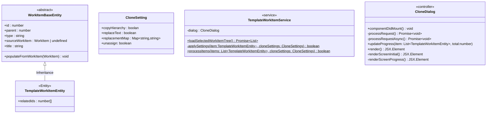
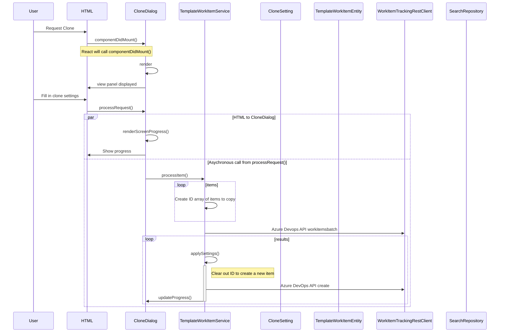

# Diagrams

## UML Class Diagrams

Not all members are shown as only the fields that is used in this diagram will be displayed. 

```mermaid
classDiagram
  class WorkItemBaseEntity {
    +id : number
    +parent : number
    +type : string
    +sourceWorkItem : WorkItem | undefined
    +title : string
    +populateFromWorkItem(WorkItem) void
  }
  <<abstract>> WorkItemBaseEntity   
  
  class TemplateWorkItemEntity {
    +relatedIds : number[]    
  }
  WorkItemBaseEntity <|-- TemplateWorkItemEntity : Inheritance
  <<Entity>> TemplateWorkItemEntity   
  
  class CloneSetting {
    +copyHierarchy : boolan
    +replaceText : boolean
    +replacementMap : Map~string,string~
    +unassign: boolean    
  }
  
  class TemplateWorkItemService {
    -dialog : CloneDialog
    +loadSelectedWorkItemTree()$ Promise~List~
    -applySettings(item:TemplateWorkItemEntity~, cloneSettings: CloneSettings)$ boolean
    +processItems(items: List~TemplateWorkItemEntity~, cloneSettings: CloneSettings)$ boolean
  }
  <<service>> TemplateWorkItemService   

  class CloneDialog {
    +componentDidMount() void
    -processRequest() Promise~void~
    -processRequestAsync() Promise~void~
    +updateProgress(item: List~TemplateWorkItemEntity~, total:number)
    +render() JSX.Element
    -renderScreenInitial() JSX.Element 
    -renderScreenProgress() JSX.Element
  }
  <<controller>> CloneDialog   
```

## Sequence Diagram

```mermaid
sequenceDiagram
    participant User
    participant HTML
    participant CloneDialog
    participant TemplateWorkItemService
    participant CloneSetting
    participant TemplateWorkItemEntity
    participant WorkItemTrackingRestClient 
    participant SearchRepository

    User->>HTML: Request Clone
    HTML->>CloneDialog: componentDidMount()
    Note over HTML,CloneDialog: React will call componentDidMount()
    CloneDialog->>CloneDialog: render
    CloneDialog->>HTML: view panel displayed
    User->>HTML: Fill in clone settings
    HTML->>CloneDialog:processRequest()
    par HTML to CloneDialog
      CloneDialog->>CloneDialog: renderScreenProgress()
      CloneDialog->>HTML: Show progress    
    and Asychronous call from processRequest()
      CloneDialog->>TemplateWorkItemService: processItem()
        loop items
          TemplateWorkItemService->>TemplateWorkItemService: Create ID array of items to copy
        end
        TemplateWorkItemService->>WorkItemTrackingRestClient: Azure Devops API workitemsbatch
        loop results
          TemplateWorkItemService->>TemplateWorkItemService: applySettings()
          activate TemplateWorkItemService        
          Note right of TemplateWorkItemService: Clear out ID to create a new item
          TemplateWorkItemService->>WorkItemTrackingRestClient: Azure DevOps API create
          TemplateWorkItemService->>CloneDialog: updateProgress()
          deactivate TemplateWorkItemService
        end
      
    end
    
```
